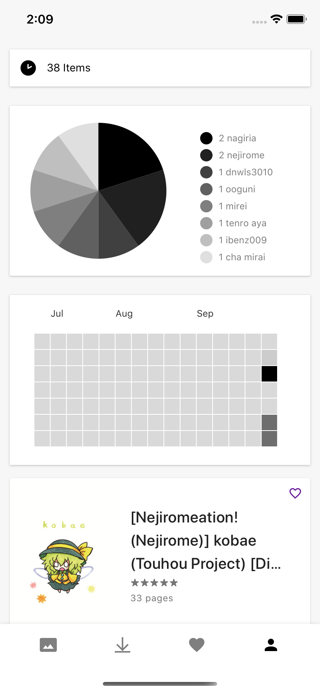

# Introduction
MangaE is a React Native app parsing E-H web contents.

Functions: 
  1. Download manga
  2. Favourites & History
  3. Save personal preference from categories / artists / misc viewed
  4. Fast search from frequently viewed tags
    
# Demo



# Build

Run on emulator / device
```
yarn run ios
or
yarn run android
```

Build Android APK Release
```
cd android && ./gradlew assembleRelease
```
